# Custom Mastodon domain using Cloudflare Workers

> Use your own domain as an alias of your Mastodon handle.

When presented with a string like `ps@infosec.exchange`, Mastodon clients use the WebFinger protocol to retrieve a JSON document pointing to resources related to this account.
We can make use of this by proxying requests to our own custom domain at `/.well-known/webfinger` to the actual Mastodon instance using Cloudflare Workers.

```mermaid
flowchart TD
  origin("Client calls webfinger endpoint for ps@pstadler.dev:<br>https://pstadler.dev/.well-known/webfinger?resource=acct:ps@pstadler.dev")
  subgraph worker[Cloudflare Worker]
    mapping("Find target for alias in mapping:<br>ps@pstadler.dev → ps@infosec.exchange")
    -->
    target("Call webfinger endpoint for target:<br>https://infosec.exchange/.well-known/webfinger?resource=acct:ps@infosec.exchange")
  end
  response("Client receives response for ps@infosec.exchange")
  origin --> worker --> response
```



## Configuration

Configure your aliases at the top of `webfinger.js`. Multiple entries are supported.

```js
const MAPPING = new Map([
  ['ps@pstadler.dev', 'ps@infosec.exchange'],
  ['foo@pstadler.dev', 'bar@example.org']
])
```

## Testing

You can test this worker locally using [miniflare](https://miniflare.dev/).

```sh
$ npm install
$ npm run dev

$ curl http://127.0.0.1:8787\?resource\=acct:ps@pstadler.dev
{"subject":"acct:ps@infosec.exchange","aliases":["https://infosec.exchange/@ps","https://infosec.exchange/users/ps"],"links":[{"rel":"http://webfinger.net/rel/profile-page","type":"text/html","href":"https://infosec.exchange/@ps"},{"rel":"self","type":"application/activity+json","href":"https://infosec.exchange/users/ps"},{"rel":"http://ostatus.org/schema/1.0/subscribe","template":"https://infosec.exchange/authorize_interaction?uri={uri}"}]}
```

## Deployment

Copy `wrangler.toml.example` to `wrangler.toml` and change values according to your needs.

```sh
# Either make sure `wrangler` is available on your system, or run
# `npm install` and add `./node_modules/.bin` to your PATH variable.
$ wrangler login
$ wrangler publish

$ curl https://pstadler.dev/.well-known/webfinger\?resource\=acct:ps@pstadler.dev
{"subject":"acct:ps@infosec.exchange","aliases":["https://infosec.exchange/@ps","https://infosec.exchange/users/ps"],"links":[{"rel":"http://webfinger.net/rel/profile-page","type":"text/html","href":"https://infosec.exchange/@ps"},{"rel":"self","type":"application/activity+json","href":"https://infosec.exchange/users/ps"},{"rel":"http://ostatus.org/schema/1.0/subscribe","template":"https://infosec.exchange/authorize_interaction?uri={uri}"}]}
```

## Caveats

As of early 2023, some native Mastodon clients don't seem to make use of WebFinger when searching for users, which will result in your profile not being found with this approach.
